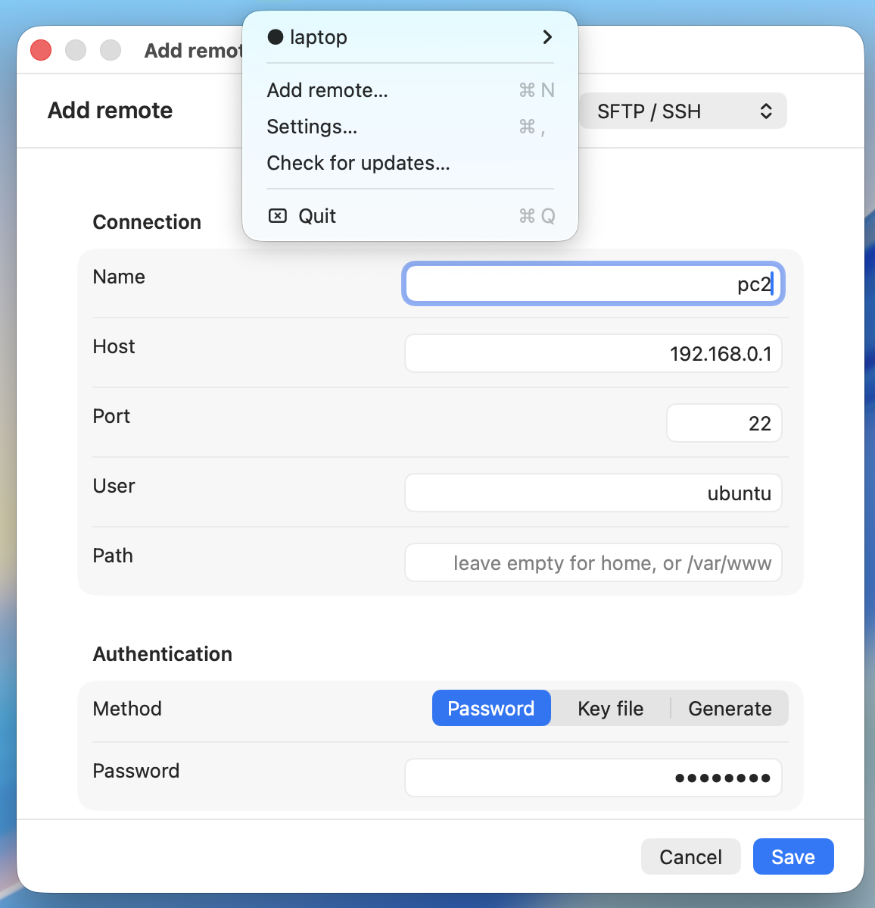

<div align="center">

# macsh

**Mount SFTP, S3, and FTP servers as native macOS volumes.**
No macFUSE. No kernel extensions. No security prompts.

[Download](https://github.com/AyonPal/macsh/releases) ·
[Install instructions](#install)

</div>

---

## What it does

<p align="center">
  
</p>

Your remote files, in Finder. Open, edit, drag — like any folder on your Mac.

## Highlights

- **SFTP / SSH** — password, existing key file, or generate a new key in-app.
- **S3-compatible** — AWS, Cloudflare R2, Backblaze B2, Wasabi, MinIO, DigitalOcean Spaces, custom endpoints.
- **FTP / FTPS** — explicit or implicit TLS.
- **Live updates** — changes on the server show up in seconds.
- **Auto-mount at login.**
- **Passwords stored in your Keychain** — never on disk in plaintext.

## Install

Releases are **unsigned** (no Apple Developer ID yet). Download the DMG
from the [latest release](https://github.com/AyonPal/macsh/releases)
and drag the app to `/Applications`.

Then run **one** of these commands once, matching the version you installed:

```bash
# if you installed macsh
xattr -dr com.apple.quarantine /Applications/macsh.app

# if you installed macsh-lite
xattr -dr com.apple.quarantine /Applications/macsh-lite.app
```

That clears macOS's Gatekeeper flag. Without it you'll see
*"macsh is damaged and can't be opened"* — that's Gatekeeper, not
actual corruption.

After that, launch the app. A small icon appears in your menu bar; click
it to add your first remote.

### Two flavours

|              | `macsh`                       | `macsh-lite`                 |
| ------------ | ----------------------------- | ---------------------------- |
| **DMG size** | ~32 MB                        | ~600 KB                      |
| **rclone**   | bundled inside the app        | uses your `brew install rclone` |
| **Best for** | "just works" install          | smaller download / power users |

Pick one. They can coexist if you really want both.

## Requirements

- macOS **14 (Sonoma)** or later
- Apple Silicon (M-series). Intel is not supported.

## Contributing

Bug reports and PRs welcome. Especially useful right now:

- Code signing / notarization (Apple Developer ID).
- Additional backends.

## License

[Apache License 2.0](LICENSE) © 2026 Ayon Pal
